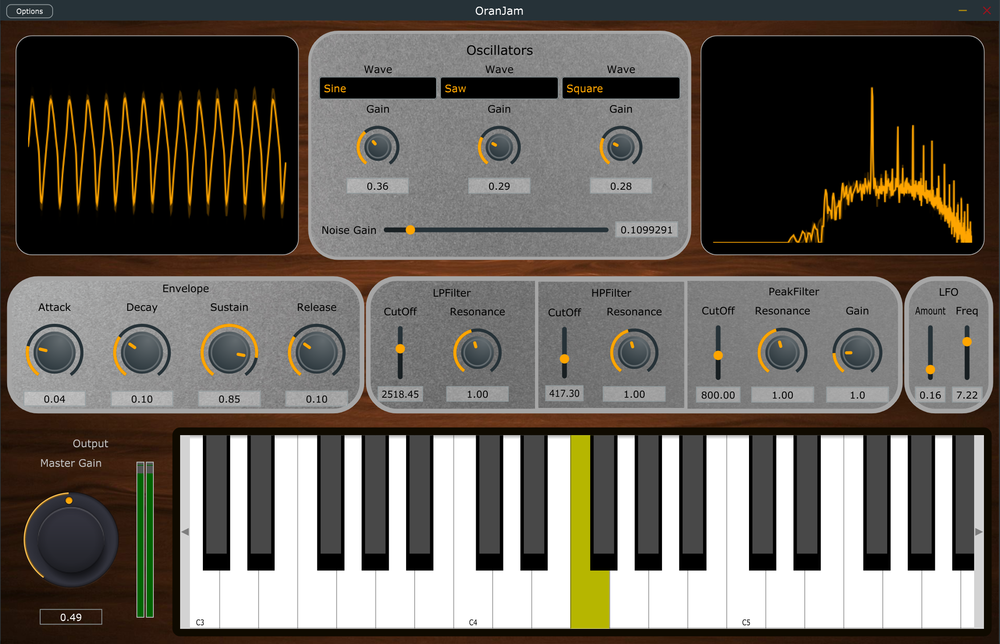
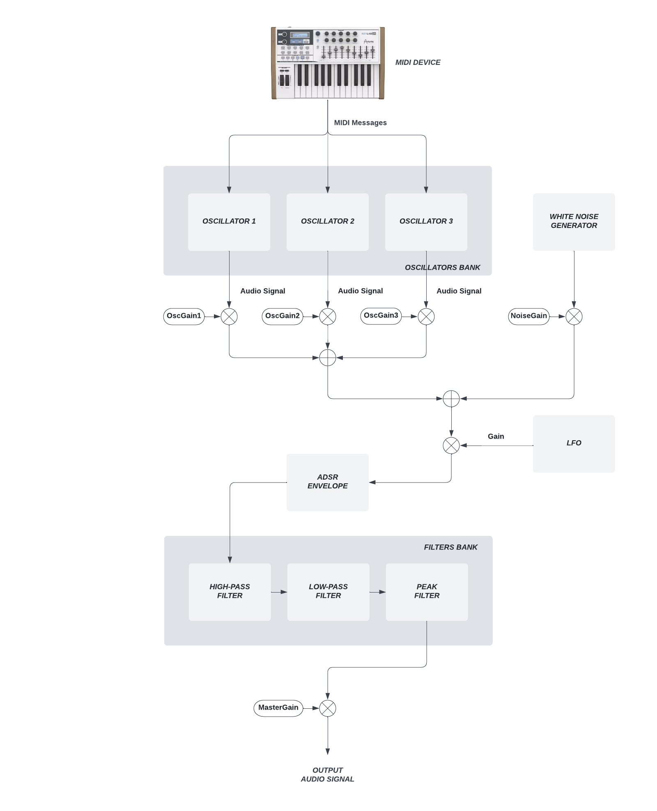

# OranJam
**OranJam** is an **instrument plugin** which implements a **polyphonic subtractive synthesizer**. The software was implemented in **C++ programming language** with the aid of **JUCE framework**, a very powerful **multi-platform** and **cross-standard** library which supports different operating systems (MacOS, Windows, Linux) and plugin standards available on the market today (VST, VST3, Audio Unit, Audio Unit V3, RTAS, AAX). The **DSP chain** includes several functional blocks: an **oscillators bank**, a **white noise generator**, an **ADSR envelope**, a **filters bank** and a **LFO**. A **Graphical User Interface** (Figure below) enables the user to control available parameters, such as Waveform for each oscillator, CutOff Frequency and Resonance for each filter.  
Within the **Release** folder, three release builds of OranJam instrument plugin are available for instant use: Audio Unit (AU), VST3 and standalone.

  

## Graphical User Interface
The JUCE framework offers the chance to create a custom **Graphical User Interface (GUI)** that implements and connects all parameters of interest in a designed component called the PluginEditor essentially from scratch. However, during the preliminary phase of design of the synthesizer, we found an external library called **foleys_gui_magic** ([GitHub repository](https://github.com/ffAudio/foleys_gui_magic)), that would allow us to have a better workflow and ultimately a more pleasing GUI. For this reason, the GUI of SubSynth plugin was implemented with the aid of this powerful library.

The available controls are graphically divided in six main groups:
- The **keyboard** generates MIDI signals, allowing the user to have a ready to play virtual instrument. This is good for testing it and experimenting with it, but of course, the plugin also works with an external MIDI generator or an external MIDI keyboard, which is recommended.

- The **Output** group, composed by:
  - The **Master Gain**, a knob at the end of the processing chain, used to control the overall output volume of the synthesizer.
  - The **Meter**, which shows the overall output level.

- The **Oscillators** group, composed by:
  - Three **Wave selectors**, one for each oscillator, that allow switching between Sinusoidal, Saw and Square waveform and the relative **Gain knob**, controlling the corresponding Volume.
  - The **Noise Gain**, controlling the level of a random process that is added in cascade after the signal created by the oscillators and conceptually acting as an additional oscillator as well.

- The **Envelope** group, composed by **Attack**, **Decay**, **Sustain** and **Release** knobs, allows the user to shape the amplitude of the played note in four moments linear regions with a linear behavior.

- The **Filters** group, composed by:
  - A **Low-pass Filter** that applies low-pass filtering to the signal, offering the user control on the **CutOff Frequency** and **Resonance**, which boosts the signal around the frequency of CutOff by the selected amount.
  - An **High-pass Filter** that applies high-pass filtering to the signal, offering the user control on the **CutOff Frequency** and **Resonance**, which boosts the signal around the frequency of Cutoff by the selected amount.
  - A **Peaking Filter** that applies a peaking filter to the signal, offering the user control on the **CutOff Frequency**, **Gain**, which boosts the signal around the frequency of Cutoff by the selected amount following a bell-shaped function and **Resonance** which determines the said bell’s width.

- The **LFO** group, that controls a **Low Frequency Sinusoidal Oscillator**, which modulates the volume of the three oscillators and the Noise, through the available knob control:
  - The **Amount** knob, which is the amplitude of the generated sinusoid.
  - The **Frequency** knob, dictating the frequency of the oscillator.

## Software Architecture
The jucer file **SubtractiveSynth.jucer** allows the user to run the software and then it can be exported in an **external IDE**. Another possibility is to build the project with **CMake** (see **CMake installation steps** section below).
The architecture of the software is modular. Exploiting the Object-Oriented nature of the C++ programming language, the software is divided in many classes: each one implements a specific functionality of the plugin. The namespaces **Generators**, **Oscillators** and **Filters** are **external modules**, included in the Modules package.
The class **ParametersManager** initializes all the parameters of the subtractive synthesizer and sets all their value ranges. The namespace **Oscillators**, thanks to its subclass **MultiWavesOscillator**, generates the sinusoidal, square and saw original waves. The class **Envelope**, placed inside **Generators**, implements the **ADSR** in the signal flow, and **WhiteNoise**, that provides all the functionalities that are needed to generate the **white noise**, added afterwards to the waveforms.
The namespace **Filters** has everything it needs to implement the **filters**, importing the **HPFilter**, **LPFilter** and **PeakFilter** classes.
The package **foleys_gui_magic** is imported in order to provide all the functionalities of the Graphical User Interface.

  

**You're now ready to jump into OranJam wonderful world! Let's play some music!**
